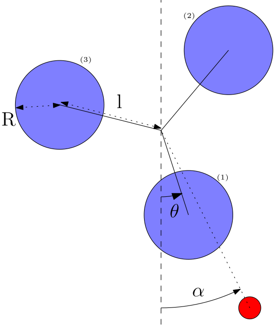

# Pulsed-Pendulum
Study of the pulsed pendulum system

Introduction
============

Le monde regorge de systèmes dont le mouvement ne peut pas être décrit
par des équations simples à solutions analytiques classiques,
périodiques et stables. Ces systèmes sont appelés *systèmes chaotiques*.
Leur étude est relativement récente puisqu’elle nécessite des
algorithmes complexes pour la résolution des équations, grandement
facilitée par l’outil numérique.

Ce projet s’intègre dans la démarche d’étude des systèmes chaotiques à
l’aide de l’outil informatique. Il a pour but de modéliser et d’étudier
la dynamique d’un système chaotique que nous nommerons *pendule pulsé*
tout au long de ce rapport. Il s’agit d’observer sa **transition de
l’ordre vers le chaos** avec l’évolution des paramètres utiles en
modélisant le mouvement et de regarder les phénomènes de **résonance**
ainsi que d’**accrochage de fréquences** que l’on définira.

Il sera essentiel d’effectuer tout d’abord une description rigoureuse du
système et d’**établir ses équations de mouvement**. Ensuite, nous
étudierons différentes méthodes de résolution d’équations
différentielles et de modélisation afin de représenter le système en
mouvement. Les phénomènes de **résonance** et d’**accrochage** pourront
dès lors être mis en évidence à partir du comportement du système.

Le pendule pulsé
================

Description du système
----------------------

Le pendule pulsé est un système à un seul degré de liberté. Il est
composé de 3 disques de masse *M* et de rayon *R* pouvant tourner autour
d’un axe central. Ils y sont reliés par des tiges de longueur *l*. Ces
disques sont mis en mouvement par un aimant, ayant lui-même un mouvement
périodique forcé de pulsation &omega;.

L’angle entre le disque 1 et la verticale est noté &theta;(t). Les
angles pour les autres disques sont alors égaux à &theta;(t) à 2&pi;/3 près.
&alpha; est l’angle entre
l’aimant et la verticale et comme le mouvement de l’aimant est
périodique de pulsation &omega;, alors

=\alpha_0\text{cos}(\omegat))
$\alpha (t) = \alpha_0 \text{cos}(\omega t),$

avec &alpha;0 dans [-&pi;;&pi;]. La coordonnée généralisée
choisie pour déterminer les équations du mouvement est &theta;(t).

Dérivation des équations du mouvement
-------------------------------------

En utilisant le Lagrangien du système, les équations du mouvement sont
les équations d’Euler-Lagrange. Pour les établir, il faut utiliser
l’énergie cinétique totale du système définie comme

$$T = 3\frac{Ml^2\dot{\theta}^2}{2} + 3\frac{I_{disque}\dot{\theta}^2}{2},$$

où $I_{disque}$ est le moment d’inertie d’un disque par rapport à l’axe
central du pendule. D’après le théorème de Huygens et en connaissant le
moment d’inertie d’un disque par rapport à son centre, on obtient

$$I_{disque} = \frac{MR^2}{2}+Ml^2,$$

d’où

$$T = 3\dot{\theta}^2\left(\frac{MR^2}{4} + Ml^2\right).$$

Le potentiel total du système sera utilisé et son expression peut être
établie à l’aide de @cours_chaos_faure

$$V = V_0 \alpha_M^2\sum_{k=0}^3\left[\frac{1}{\alpha_M^2+(\theta-\alpha+\frac{2k\pi}{3})}\right].$$

On en déduit le Lagrangien du système

$$\mathcal{L} = T - V = 3\dot{\theta}^2\Big(\frac{MR^2}{4} + Ml^2\Big) - V_0 \alpha_M^2\sum_{k=0}^3\left[\frac{1}{\alpha_M^2+(\theta-\alpha+\frac{2k\pi}{3})}\right],$$

ce qui revient à une équation d’Euler-Lagrange

$$\label{eq:E-L}
\frac{d}{dt}\frac{\partial \mathcal{L}}{\partial \dot{\theta}} = \frac{\partial \mathcal{L}}{\partial \theta}.$$

L’équation [eq:E-L] devient l’équation différentielle du mouvement en
calculant les différents termes

$$\frac{d^2\theta}{dt^2} = \frac{-4}{3M(R^2 + 4l^2)}\frac{\partial V}{\partial \theta},$$

avec

$$\frac{\partial V}{\partial \theta} = V_0 \alpha_M^2\sum_{k=0}^3\left[\frac{-2(\theta-\alpha+\frac{2k\pi}{3})}{\big(\alpha_M^2+(\theta-\alpha+\frac{2k\pi}{3})\big)^2}\right].$$

Dans la suite du rapport, on écrira
$\ddot{\theta} = f(\dot{\theta}, \theta, t)$ avec

$$f(\dot{\theta}, \theta, t) = \frac{-4V_0 \alpha_M^2}{3M(R^2 + 4l^2)} \sum_{k=0}^3\left[\frac{-2(\theta-\alpha+\frac{2k\pi}{3})}{\big(\alpha_M^2+(\theta-\alpha+\frac{2k\pi}{3})\big)^2}\right]$$
